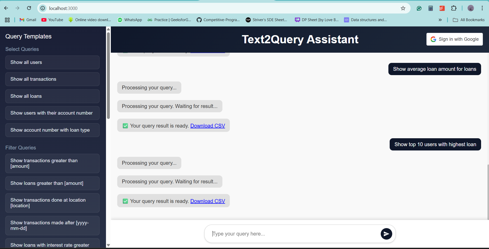

# Text-to-Query

Developed a Text2Query Results Generator system for a large banking corporation, enabling non-technical users to obtain SQL query results in response to plain English queries. Designed an intuitive chat-based GUI and an automated SQL generator in JavaScript, connected to a relational database for real-time data retrieval. Delivered results in downloadable CSV/Excel formats, reducing dependency on data analysts and expediting stakeholder access to data insights. Implemented a meta-model update interface to ensure accurate query conversions based on database schema changes.

